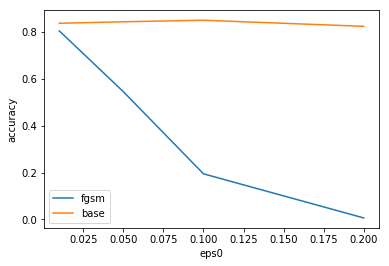
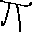
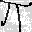
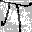
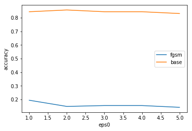
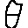

## 課題2
accuracy: 0.8377

## 課題3
| method \ eps0 | 0.01 | 0.05 | 0.1 | 0.2 |
|:-|:-:|:-:|:-:|:-:|
| FGSM | 0.8052 | 0.5455 | 0.1948 | 0.006494 |
| Base | 0.8377 | 0.8377 | 0.8442 | 0.8052 |

$\epsilon_0 = 0.2$とするとaccuracyはかなり落ちるが生成画像はかなりノイズの乗ったものとなった. (下画像右)

左は元画像で$\pi$と識別されるが, FGSMによって生成された中央画像($\epsilon_0=0.1$)は$\sigma$と識別された.

## 課題4
入力$x$に対してFGSMを複数回適用して$\tilde{x}_n$を作成してaccuracyの変化を追った.
この課題では$\epsilon_0 = 0.1$とした.

| method \ iter| 1 | 2 | 3 | 4 | 5 | 6 |
|:-|:-:|:-:|:-:|:-:|:-:|:-:|
| FGSM | 0.1948 | 0.1494 | 0.1558 | 0.1558 | 0.1429 | 0.1364 |
| Base | 0.8377 | 0.8247 | 0.8442 | 0.8442 | 0.8377 | 0.8571 |

ランダムにノイズを乗せた場合ほとんどaccuracyに影響を与えなかったが, FGSMを複数回適用すると
accuracyが6%弱下がった.
また, 以下に示すように6回程繰り返すことで収束した.

左から順にoriginal, FGSM(iter=1), FGSM(iter=10)の画像を示す.

左二つは$\theta$と識別されているが, 一番右のみ$\beta$と識別された.
